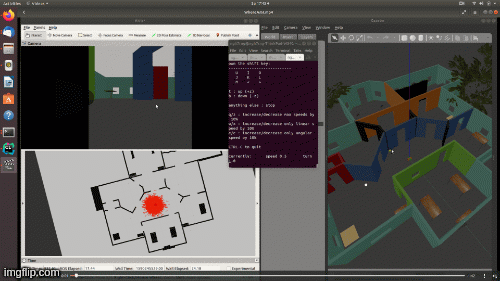

# Project 3: Where Am I

Localization of a mobile robot in ROS using Adaptive Monte Carlo Localization.
This project is part of Udacity Robotics Software Engineer Nanodegree.

<a href="https://www.youtube.com/watch?v=XO9q-1EyGBc" target="_blank">
</a>

## Description
The project consists of the following parts:
1. A Gazebo world and a mobile robot from this [project](https://github.com/huuanhhuynguyen/RoboND-Go-Chase-It).
2. ROS packages: [map_server](http://wiki.ros.org/map_server), [amcl](http://wiki.ros.org/amcl), 
[move_base](http://wiki.ros.org/move_base).
3. The pgm map file from the [map](./my_robot/maps) folder is generated by the 
[pgm_map_creator](https://github.com/hyfan1116/pgm_map_creator) tool.

## Prerequisites
1. ROS (Melodic/Kinetic), Gazebo on Linux
2. CMake & g++
3. Install dependencies
```
$ sudo apt-get update && sudo apt-get upgrade -y
$ sudo apt-get install ros-${ROS_DISTRO}-map-server
$ sudo apt-get install ros-${ROS_DISTRO}-amcl
$ sudo apt-get install ros-${ROS_DISTRO}-move-base
```

## Build and Launch
1. Clone project and initialize catkin workspace
```
$ mkdir catkin_ws && cd catkin_ws
$ git clone https://github.com/huuanhhuynguyen/RoboND-Where-Am-I.git
$ mv RoboND-Where-Am-I src
$ cd src && catkin_init_workspace
```

2. Also within `catkin_ws/src`, clone the `teleop` package
```
$ git clone https://github.com/ros-teleop/teleop_twist_keyboard
```

3. Move back to `catkin_ws\` and build
```
$ cd ..
$ catkin_make
```

4. Launch the world and robot
```
$ source devel/setup.bash
$ roslaunch my_robot world.launch
```

5. Open another terminal (Ctrl+Shift+T), and launch the `amcl.launch` file. Here,
the map_server, amcl, and move_back packages will be launched.
```
$ source devel/setup.bash
$ roslaunch my_robot amcl.launch
```

6. Open another terminal, and run the `teleop` node.
```
$ source devel/setup.bash
$ rosrun teleop_twist_keyboard teleop_twist_keyboard.py
```

7. Click on this terminal, type keyboard to navigate the robot around. The 
localization algorithm will update particles as the robot pose is updated.

8. Click on the Gazebo window and kidnap the robot to a random position in the
house. Let the robot rotate for a while, it can quickly localize.

**Note**: Since the map (pgm file) is not perfect, there will be cases where the robot 
"mislocalize" itself. For example, the door sizes and positions are not perfect.
The table on the map should be described by four legs, not by a filled rectangle.


